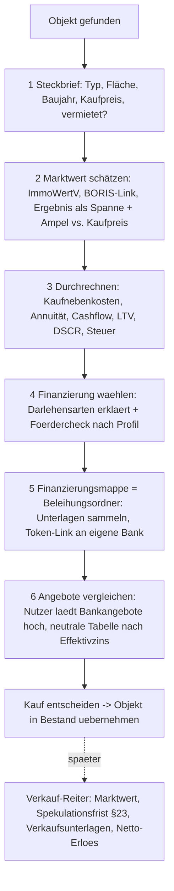

# MyImmo — Masterplan (Recherche-Synthese, Stand 15.07.2026)

Basis: vier tiefe Web-Recherchen (Markt/Zielgruppe, Wettbewerb, Regulatorik, Steuern, AVV/DSGVO)
über seriöse Quellen (IW Köln, Destatis, BaFin, BMF, DSK, Anbieter-Originalseiten). Quellen-Links
jeweils am Abschnittsende. **Keine Rechts-/Steuerberatung** — kritische Punkte vor Umsetzung
anwaltlich bzw. steuerlich prüfen lassen.

---

## 0. Executive Summary — die 10 wichtigsten Erkenntnisse

1. **Der Markt ist groß und alt:** ~5,5 Mio. private Vermieterhaushalte, 64 % des Mietwohnungs-
   bestands, Durchschnittsalter 58 (41 % über 65), ~75 % besitzen max. 2 Wohnungen. → UI muss
   maximal einfach sein; Wachstumssegment sind Erben/junge Nebenerwerbsvermieter.
2. **Rechtlich größte Lücke: MyImmo muss den eigenen Nutzern einen AVV anbieten** (Vermieter =
   Verantwortliche für Mieterdaten, MyImmo = deren Auftragsverarbeiter, Art. 28 DSGVO). objego
   und vermietet.de machen genau das (AVV als AGB-Bestandteil). Ohne ihn verarbeiten unsere
   Nutzer Mieterdaten rechtswidrig — Bußgeldrisiko für beide Seiten.
3. **Vercel-DPA gilt nur ab Pro-Plan** (20 $/Monat); der Hobby-Plan verbietet zudem kommerzielle
   Nutzung. → Upgrade ist keine Kür, sondern Compliance-Voraussetzung.
4. **Impressum/Datenschutz-Platzhalter der live erreichbaren App sind JETZT ein Abmahnrisiko**,
   nicht erst „später".
5. **Vor dem Abo-Launch sind vier Verbraucherrechts-Bausteine Pflicht:** Button-Lösung (§ 312j),
   Widerrufsbelehrung + Erlöschens-Checkbox, **Kündigungsbutton (§ 312k, ohne Login erreichbar)**
   und der neue **Widerrufsbutton (§ 356a BGB, gilt seit 19.06.2026)**.
6. **Entwarnungen:** kein Datenschutzbeauftragter nötig (< 20 Personen), kein Cookie-Banner nötig
   (nur funktionale Cookies), BFSG-ausgenommen (Kleinstunternehmen), keine BaFin-Registrierung
   (Enable Banking ist der lizenzierte AISP), GoBD gelten nicht für private Vermieter-Nutzer.
7. **KI-OCR und Banking sind keine Alleinstellungsmerkmale mehr** (hellohousing: KI-Belege +
   finAPI; immocloud: automatische Mietbuchung). Differenzierung liegt in **proaktiven
   Steuer-Wächtern**, die kein Wettbewerber hat (15 %-Grenze, 66 %-Ampel, § 82b).
8. **Steuer-Features mit höchstem Hebel:** 15 %-Grenzen-Wächter (anschaffungsnahe Herstellungs-
   kosten), § 35a-Ausweis in der NK-Abrechnung, § 82b-Verteilung, verbilligte-Vermietung-Ampel,
   AfA-Assistent. Daten dafür sind größtenteils schon in der App.
9. **Ohne öffentliche Preisseite, Ratgeber/Vorlagen und Vergleichsportal-Listungen bleibt MyImmo
   unsichtbar** — SEO-Content + kostenlose Vorlagen sind die Trafficstrategie ALLER Wettbewerber.
10. **Konkrete Marktchance:** vermietet.de/VermietenPlus steht bei Trustpilot 1,4/5 (Migrations-
    Frust) — ein Datenimport „Umzug von vermietet.de" wäre gezielte Abwerbung.

---

## 1. Zielgruppe & Markt

| Kennzahl | Wert | Quelle |
|---|---|---|
| Private Vermieterhaushalte | ~5,5 Mio. (2011: 4,2 Mio.) | IW Köln / Zensus 2022 |
| Wohnungen privater Kleinvermieter | ~16,1 Mio. = 64,4 % des Mietbestands | iwd.de |
| Durchschnittsalter | 58 Jahre; 41 % über 65; nur 5 % unter 35 | IW Vermieterreport 2026 |
| Bestandsgröße | 58 % nur 1 Objekt, 19 % zwei | IW Vermieterreport 2026 |
| Pain Point Nr. 1 | NK-Abrechnung (> 80 % fehlerhaft, Ø-Korrektur ~515 €) | Finanztip u. a. |

Konsequenzen:
- **Einfachheit schlägt Funktionsumfang** (Zielgruppe 58+, 1–2 Einheiten): geführte Abläufe,
  große Schrift, wenig Fachjargon, Onboarding-Tour (steht schon auf der Merkliste).
- **Preissensibilität**: bei 1–2 Einheiten zählt der absolute Monatspreis, Marktspanne
  Einstieg 4,50–10 €/Monat.
- **Sekundärzielgruppe Erben**: Content/Landingpage „Geerbte Immobilie vermieten — was jetzt?"
  (steuerlich + organisatorisch) besetzt ein wachsendes, kaum umkämpftes Thema.

Quellen: iwkoeln.de (Gutachten „Private Vermieter in Deutschland", Vermieterreport 2026),
iwd.de/artikel/die-meisten-mietwohnungen-gehoeren-privaten-kleinvermietern-684097/, destatis.de,
finanztip.de/nebenkostenabrechnung/

## 2. Wettbewerb & Positionierung

| Anbieter | Preis (Einstieg) | Stärken | Schwächen/Notizen |
|---|---|---|---|
| VermietenPlus (ImmoScout24, ex vermietet.de) | 9,90 €/M + 0,99 €/Einheit | Portal-Reichweite, Anlage V, Mietüberwachung | **Trustpilot 1,4/5**, Migrations-Bugs |
| objego (ista + Aareal) | Basis gratis; Verwaltung 7,95 €/M; NK 0,95 €/Einheit | NK/Heizkosten (ista-DNA), Vorlagen (67k Downloads), AVV sauber | NK nur im Bezahlmodul |
| immocloud | 9,99 €/M netto (bis 5 Einheiten) | Mieterportal, DATEV, Webinare/Community, 4,6★ | teuerster Einstieg, eher (Semi-)Profis |
| hellohousing | 4,50 €/M | KI-Belege, HKVO-Heizkosten, Funkzähler, Post-Versand | wenig Trust-Elemente |
| Haufe/Lexware | ~80–120 €/Jahr | Marke | Desktop-Altsoftware |

**Tabellen-Standard, den MyImmo für Vergleichsportale braucht** (trusted.de, softwareabc24 ranken
danach): öffentliche Preisseite · kostenlose Testphase · HKVO-konforme Heizkostenabrechnung ·
Mieterportal · Vorlagen-Downloads · Mobile-Tauglichkeit · Bewertungssiegel.

**Lücken, die (fast) keiner besetzt → MyImmo-Differenzierung:**
- Proaktive Steuer-Wächter (siehe Abschnitt 5) — bietet keiner.
- End-to-End-KI-Flow „NK-Abrechnung per Foto komplett vorbefüllt" als kommuniziertes ERGEBNIS
  (Zeitersparnis), nicht als Technik-Feature.
- Rückstands-Wächter als benanntes Hero-Feature mit Mahn-Vorschlägen (existiert bei uns schon!).
- Großzügiger Free-Einstieg (z. B. 1 Objekt inkl. 1 NK-Abrechnung/Jahr) — objego ist „free" nur
  ohne NK-Modul.
- Import-Assistent „Umzug von vermietet.de" (deren 1,4-Sterne-Krise nutzen).
- WEG-Schmerzpunkt der Kleinvermieter: Hausgeldabrechnung → NK-Abrechnung überführen (ETW-
  Vermieter in WEGs) — von keiner Kleinvermieter-App gelöst.

Quellen: immobilienscout24.de (VermietenPlus-LP), objego.de, immocloud.de/tarife/,
hellohousing.de, trusted.de/hausverwaltungssoftware, softwareabc24.de/vermieter-software/

## 3. Compliance — priorisierte Pflichtenliste

### P0 — sofort (App ist live erreichbar)
| # | To-do | Grundlage |
|---|---|---|
| 1 | Impressum + Datenschutzerklärung mit echten Daten füllen (inkl. Passagen: Supabase, Vercel, Anthropic-OCR, Google-Login, Cookies/Storage, Betroffenenrechte) | § 5 DDG, Art. 13 DSGVO |
| 2 | **Vercel auf Pro upgraden** (20 $/M) — aktiviert den Vercel-DPA und beendet den Hobby-Plan-Verstoß (kommerzielle Nutzung) | Vercel ToS/DPA |
| 3 | **Supabase-DPA signieren**: Dashboard → Organisation → Documents → PandaDoc-Flow (kostenlos, auch im Free-Plan); TIA-PDF ablegen | Art. 28 DSGVO |
| 4 | **Anthropic-DPA archivieren** (ist mit Commercial Terms automatisch wirksam); DPF-Status im Register dataprivacyframework.gov prüfen; Modell der OCR-Route auf Retention-Klasse prüfen | Art. 28 DSGVO |
| 5 | Google: **kein AVV nötig** (eigenständig Verantwortlicher beim OAuth-Login) — aber Datenschutzerklärungs-Passus mit Datenkategorien, Art. 6 Abs. 1 lit. b, Google-Privacy-Link | Art. 13 DSGVO |
| 6 | **Eigenen Nutzer-AVV** unter `/avv` bereitstellen, per AGB einbeziehen, bei Registrierung akzeptieren lassen. Anlagen: Verarbeitungsgegenstand, TOMs, Subprozessorenliste (Supabase, Vercel, Anthropic, später Enable Banking). Anwaltlich prüfen lassen | Art. 28 Abs. 3 DSGVO |
| 7 | Verarbeitungsverzeichnis Art. 30 Abs. 1 UND Abs. 2 + TOM-Dokument schreiben (Vorlage: DSK-Kurzpapier Nr. 1; unser Material: AES-256-GCM, RLS, Blind-Index) | Art. 30, 32 DSGVO |

### P1 — vor dem ersten zahlenden Kunden
- Button-Lösung („zahlungspflichtig abonnieren", Pflichtinfos direkt am Button), § 312j BGB.
- Widerrufsbelehrung + Muster-Formular + Checkbox „sofortiger Beginn = Erlöschen" (§ 356 BGB),
  Vertragsbestätigung per E-Mail (§ 312f BGB).
- **Kündigungsbutton** § 312k BGB — ohne Login erreichbar, zweistufig, Zugangsbestätigung.
- **Widerrufsbutton** § 356a BGB (gilt seit 19.06.2026) — zweistufig, während der ganzen Frist.
- PAngV: Preise inkl. USt. bzw. Kleinunternehmer-Hinweis (§ 19 UStG); AGB mit Laufzeitregeln
  (§ 309 Nr. 9 BGB) als Andockpunkt für den AVV.

### P2 — vor Banking-Live (steht teilweise schon in CLAUDE.md)
- Production-Vertrag + AVV mit Enable Banking; vertragliche Klarstellung, dass EB der AISP ist;
  optional schriftliche Bestätigung, dass unser Modell keine eigene Registrierung auslöst
  (Restrisiko der AIS-Abgrenzung dokumentieren). Subprozessorenliste aktualisieren.
- DSFA-Schwellenprüfung (Art. 35) dokumentieren, sobald Bankumsätze live sind.

### Entwarnungen (geprüft, KEINE Pflicht)
- **Kein DSB** (< 20 Personen, § 38 BDSG; Art.-37-Tatbestände nicht erfüllt).
- **Kein Cookie-Banner** (nur funktionale Cookies/Session → § 25 Abs. 2 TDDDG). Achtung: Vercel
  Analytics/Speed Insights oder externe Fonts würden das kippen — nicht einbauen bzw. prüfen.
- **BFSG**: Kleinstunternehmen-Ausnahme (§ 3 Abs. 3) — aber WCAG-Grundzüge (Kontrast, Tastatur,
  Labels) billig mitbauen; ab 10 MA / 2 Mio. € Umsatz gilt das Gesetz voll.
- **AI Act**: OCR mit Bestätigungs-UI = minimales Risiko; nur Art.-4-AI-Literacy-Notiz +
  KI-Transparenz in UI/Datenschutzerklärung. „Vorschlagen + bestätigen" hält uns zugleich aus
  Art. 22 DSGVO heraus — Prinzip beibehalten!
- **GoBD**: gelten nicht für die Vermieter-Nutzer (Überschusseinkünfte). Wohl aber für die
  eigene Firmen-Buchhaltung (Abo-Rechnungen 8 Jahre). „Revisionssicher" NIE ohne Zertifikat
  behaupten (Irreführung).

Quellen: dsgvo-gesetz.de/art-28|30, datenschutzkonferenz-online.de (OH Wohnraumvermietung,
Kurzpapier 1), bfsg-gesetz.de, IHK Stuttgart/Bodensee, BaFin (AIS/§ 34 ZAG), paytechlaw.com,
noerr.com (§ 356a), twobirds.com (§ 312k-Rechtsprechung), baden-wuerttemberg.datenschutz.de

## 4. AVV-Status je Anbieter (Detail → siehe AVV-Dossier-PDF)

| Anbieter | Rolle | Abschlussweg | Kosten | Drittland |
|---|---|---|---|---|
| Supabase | Auftragsverarbeiter (DB/Auth) | Dashboard → Org → Documents → PandaDoc signieren | 0 € | nur SCCs + TIA (kein DPF!) |
| Vercel | Auftragsverarbeiter (Hosting) | automatisch in ToS — **aber nur Pro/Enterprise** | Pro 20 $/M | DPF ✓ + SCCs |
| Anthropic | Auftragsverarbeiter (OCR) | automatisch mit Commercial Terms; kein Training auf API-Daten (Default) | 0 € | SCCs; DPF-Status im Register prüfen |
| Google | KEIN Auftragsverarbeiter (OAuth = eigenständig Verantwortlicher) | kein AVV — nur Datenschutzerklärung | 0 € | DPF ✓ (Google LLC) |
| Enable Banking | Auftragsverarbeiter/AISP (später) | Production-Agreement + AVV verhandeln | lfd. Kosten | EU (FIN-FSA) |
| MyImmo → Nutzer | **MyImmo ist Auftragsverarbeiter der Vermieter** | eigener Standard-AVV unter /avv, AGB-Einbeziehung | Anwaltskosten | — |

EU-US Data Privacy Framework: aktuell gültig (EuG hat Latombe-Klage 09/2025 abgewiesen),
Rechtsmittel beim EuGH anhängig (C-703/25 P) → SCC-Fallback in allen DPAs vorhanden, beide
Mechanismen in der Datenschutzerklärung nennen.

## 5. Steuer-Features (Priorität nach Nutzen/Aufwand)

1. **15 %-Grenzen-Wächter** (§ 6 Abs. 1 Nr. 1a EStG): Kaufdatum + Gebäudeanteil kennt die App →
   laufender Zähler „Renovierungskosten seit Kauf: X € von max. Y € (15 %), noch Z Monate im
   3-Jahres-Zeitraum", Warnung ab 80 %. **Kein Wettbewerber hat das.** Schützt vor dem teuersten
   Laienfehler (Sofortabzug wird rückwirkend zu 2-3 %-AfA).
2. **§ 35a-Block in der NK-Abrechnung**: Feld „davon Lohnanteil" am Beleg → automatischer
   Ausweis haushaltsnahe Dienstleistungen/Handwerker je Mieter (BFH VI R 24/20; BMF 9.11.2016).
   Gibt Mietern bares Geld, spart Vermieter-Rückfragen — starkes Marketing-Feature.
3. **§ 82b-Verteilungs-Optimierer**: Erhaltungsaufwand wahlweise auf 2–5 Jahre verteilen,
   Simulation nach Grenzsteuersatz, automatische Übernahme in Anlage-V-Folgejahre.
4. **Verbilligte-Vermietung-Ampel** (§ 21 Abs. 2 EStG): Ist-Miete vs. ortsübliche Warmmiete in %
   je Mietverhältnis; Warnung < 66 %, rot < 50 %; Jahres-Reminder (Vergleichsmieten steigen —
   klassische Angehörigen-Falle).
5. **AfA-Assistent**: Satz-Ermittlung 2/2,5/3 % nach Fertigstellungsjahr; degressiv-5 %-Vergleich
   (§ 7 Abs. 5a, Baubeginn 10/2023–9/2029) mit optimalem Wechseljahr; § 7b-Check (EH40/QNG,
   5.200 €/m²-Grenze, Warnung vor Rückgängigmachung); Kaufpreisaufteilung nach BMF-Arbeitshilfe.
6. **Spekulationsfrist-Countdown** je Objekt („steuerfrei verkaufbar ab …") + Warnung vor dem
   4. Verkauf in 5 Jahren (gewerblicher Grundstückshandel) + AfA-Rückrechnung im Verkaufsszenario.
7. **DATEV-Buchungsstapel-Export** (Konkurrenz-Parität zu immocloud, öffnet Steuerberater-Kanal).
8. **Grundsteuer-2025-Assistent in der NK-Abrechnung**: neuen Bescheid abfragen, Vorauszahlungs-
   anpassung nach § 560 BGB vorschlagen.
9. **E-Rechnungs-Parser** (XRechnung/ZUGFeRD) im Belegupload: XML lesen → Betrag/Datum/Lohnanteil
   automatisch (Handwerkerrechnungen kommen zunehmend als E-Rechnung; Empfangspflicht seit 2025).
10. **USt-25.000-€-Tracker** für steuerpflichtige Nebenumsätze (Garage extern, Mieterstrom,
    Kurzzeitvermietung) — Kleinunternehmer-Fallbeil 100.000 € (JStG 2024). Nische, niedrige Prio.

Info-Content dazu (SEO + In-App-Hinweise): § 35c gilt NICHT für Vermieter (häufiges
Missverständnis), Restnutzungsdauer-Gutachten wieder möglich (BMF-Schreiben 2023 Ende 2025
aufgehoben — vor Feature-Text beim BMF verifizieren).

Quellen: gesetze-im-internet.de (§ 7b EStG, § 82b EStDV, § 147a AO), BMF (Arbeitshilfe
Kaufpreisaufteilung, § 7b-Schreiben 21.5.2025, Kleinunternehmer-Schreiben 18.3.2025), haufe.de,
finanztip.de, BFH IX R 14/23 / VI R 24/20

## 6. Produkt-Roadmap (Vorschlag, Reihenfolge = Priorität)

**Phase A — Rechtliches Fundament (P0, blockiert alles andere)**
A1 Impressum/Datenschutz echt befüllen · A2 Vercel Pro + Supabase-DPA + Anthropic-DPA-Archiv ·
A3 eigener Nutzer-AVV (/avv, AGB, Registrierungs-Checkbox) · A4 Verarbeitungsverzeichnis + TOMs
· A5 KI-Transparenz-Hinweise in UI + Datenschutzerklärung

**Phase B — Quick Wins aus vorhandenen Daten (je 1–3 Tage)**
B1 15 %-Grenzen-Wächter · B2 § 35a-Block in NK-Abrechnung (+ Lohnanteil-Feld am Beleg) ·
B3 Spekulationsfrist-Countdown · B4 66 %/50 %-Ampel · B5 Aufbewahrungs-Hinweise im Archiv

**Phase C — Wettbewerbs-Parität (Sichtbarkeit)**
C1 Öffentliche Preisseite + kostenloses Test-/Free-Modell definieren · C2 Vorlagen-Downloads als
Lead-Magnet (Dokumentgenerator-Vorlagen öffentlich machen) · C3 Ratgeber-/Blog-Sektion (Start:
NK-Abrechnung-Fristen, Grundsteuer 2025 umlegen, geerbte Immobilie, § 35a für Mieter) ·
C4 Listungen: trusted.de, softwareabc24, hausverwaltungschecker, Capterra/GetApp · C5 Bewertungs-
Widget (Google/ProvenExpert) · C6 Import-Assistent „Umzug von vermietet.de" (CSV/Excel)

**Phase D — Differenzierung**
D1 § 82b-Optimierer + AfA-Assistent · D2 HKVO-konforme Heizkostenabrechnung (fehlender
Tabellen-Standard!) · D3 DATEV-Export · D4 E-Rechnungs-Parser · D5 Banking-Live (Enable Banking
Production + Vertrag/AVV) · D6 WEG-Modul light (Hausgeld → NK-Überführung)

**Phase E — Monetarisierung**
E1 Abo-Checkout mit allen P1-Pflichtbausteinen (Button-Lösung, Widerrufs-/Kündigungsbutton,
AGB) · E2 Abo-Zugangscodes (Fundament einladungscodes existiert) · E3 Mieterportal (bereits als
/portal begonnen) ausbauen als Premium-Feature

**Bewusst NICHT priorisiert:** eigener KI-Chatbot (Art.-50-Transparenzpflichten + Haftung),
Zahlungsauslösung/PIS (erlaubnispflichtig-nah), „revisionssicher"-Claims (Irreführungsrisiko),
natives App-Development (PWA/Mobile-Web reicht der Zielgruppe zunächst).

## 7. Website/SEO-Plan (von den Wettbewerbern gelernt)

- Muster aller erfolgreichen Anbieter: **Ratgeber-Artikel + kostenlose Vorlagen + Rechner als
  Lead-Magnete → Signup**. immocloud ist Vorbild für Struktur (Funktions-Unterseiten, Rechner,
  zielgruppenspezifische Landingpages).
- MyImmo-Start (geringster Aufwand zuerst): Funktions-Landingpages („Nebenkostenabrechnung
  online erstellen", „Anlage V für Vermieter") → öffentliche Rechner (Mietrendite existiert im
  Cockpit — öffentlich spiegeln) → 8–12 Ratgeber-Artikel entlang der Steuer-Themen aus
  Abschnitt 5 → Vorlagen-Downloads mit E-Mail-Gate.
- Trust-Elemente nachziehen: Nutzerzahl (sobald ehrlich nennbar), Testimonials aus Early-
  Access-Nutzern, „Made & hosted in Germany/EU"-Badge (Supabase eu-central-1, Verschlüsselung
  als Datenschutz-Verkaufsargument).

## 8. Risiken & blinde Flecken (ehrlich)

- **Konzern-Konkurrenz**: ImmoScout24, ista/Aareal haben Reichweite/Kapital — MyImmo gewinnt
  nicht über Feature-Menge, sondern über Einfachheit + Steuer-Intelligenz + Vertrauen.
- **KI/Banking als USP verkaufen wäre ein Fehler** — beides ist Marktstandard geworden.
- **DPF-Kippen** (EuGH C-703/25 P anhängig): SCC-Fallback vorhanden, aber Datenschutzerklärung
  doppelgleisig formulieren.
- **AIS-Abgrenzung** (Banking ohne eigene Lizenz): geringes Restrisiko, vertraglich mit Enable
  Banking absichern, Anfrage-Option BaFin dokumentieren.
- **Alterung der Zielgruppe**: 58+ heißt auch: Support-Aufwand, Erklärvideos, Telefon-/E-Mail-
  Support einplanen; reiner Self-Service passt nicht zu 41 % Ü65.
- **Ein-Personen-Betrieb**: Verfügbarkeits-/Bus-Faktor — im eigenen AVV keine SLAs versprechen,
  die nicht haltbar sind.

## 9. Offene Prüfaufträge (vor Umsetzung verifizieren)

- Aufhebung des BMF-Schreibens v. 22.2.2023 (Restnutzungsdauer): Datum/Fundstelle direkt beim
  BMF verifizieren (Sekundärquellen nennen Wirkung 1.12.2025).
- Anthropic-DPF-Status im offiziellen Register (dataprivacyframework.gov) prüfen.
- OCR-Modell-Retention (Covered Models = 30 Tage) gegen die tatsächlich genutzte Modell-ID der
  NK-OCR-Route prüfen; optional PII-Minimierung vor dem API-Call.
- Eigenen Nutzer-AVV + AGB anwaltlich prüfen lassen (ohnehin geplant mit Impressum/Datenschutz).

---

## 10. Kauf- & Verkauf-Assistent — Konzept & Recherche (17.07.2026)

Ziel: Zwei neue Reiter **Kauf** und **Verkauf**, die aus MyImmo einen Begleiter für die
*Erwerbs-/Veräußerungsphase* machen — nicht nur Bestandsverwaltung. Basis: zwei tiefe
Recherchen (ImmoWertV-Bewertung + Finanzierung/Förderung/Recht).

### 10.1 Selbstbewertung nach ImmoWertV 2021 (Marktwert-Schätzung, KEIN Gutachten §194 BauGB)

Leitverfahren automatisch nach Objekt:
- **ETW** → Vergleichswert (§§24–26): `Vergleichsfaktor × Bezugsgröße` (Gutachterausschuss-Faktoren).
- **Vermietet / MFH (Kapitalanlage)** → **Ertragswert (§§27–34)** — Kernverfahren für unsere Zielgruppe:
  `Reinertrag = Rohertrag − Bewirtschaftungskosten`; `Gebäudeertragswert = (Reinertrag − Bodenwert×LZ) × BWF`;
  `Ertragswert = Gebäudeertragswert + Bodenwert`; `BWF = (1−(1+p)^−n)/p` (p=Liegenschaftszins, n=Restnutzungsdauer).
  Bewirtschaftungskosten nach **Anlage 3** (Verwaltung 298 €/WE bzw. 357 €/ETW, Instandhaltung 11,70 €/m²·a, Mietausfallwagnis 2 %).
- **Eigengenutztes EFH/ZFH** → Sachwert (§§35–39): `Bodenwert + (NHK2010 × Baupreisindex × Regionalfaktor × RND/GND)` × **Sachwertfaktor**.
  NHK2010 (€/m² BGF, Std. 3): EFH ~835, MFH ≤6WE 825; GND Wohngebäude 80 J. (Anlage 1/4).

**Bodenrichtwerte — Linkliste je Bundesland** (Ansicht überall kostenlos):
BORIS-D (zentral, 12 Länder) https://www.bodenrichtwerte-boris.de · BW https://www.gutachterausschuesse-bw.de/borisbw/ ·
Bayern https://www.boris-bayern.de · Berlin https://fbinter.stadt-berlin.de/boris/ · Brandenburg https://www.boris-brandenburg.de/boris-bb/ ·
Bremen https://www.gutachterausschuss.bremen.de · Hamburg https://www.hamburg.de/bsw/gutachterausschuss/ ·
Hessen https://hvbg.hessen.de/immobilienwerte/boris-hessen · MV https://www.geoportal-mv.de · NDS https://immobilienmarkt.niedersachsen.de ·
NRW https://www.boris.nrw.de · RLP https://maps.rlp.de · Saarland https://geoportal.saarland.de · Sachsen https://www.boris.sachsen.de ·
Sachsen-Anhalt https://www.lvermgeo.sachsen-anhalt.de/de/gdp-kostenfreier-brw.html · SH https://www.schleswig-holstein.de/DE/GAA/ ·
Thüringen https://tlbg.thueringen.de/wertermittlung/
Ergänzend: Mietspiegel (Rohertrag), Destatis Baupreisindex Tab. 61261 (NHK-Aktualisierung), vdp-Preisindex (Trend, echte Transaktionen),
Grundstücksmarktberichte der Gutachterausschüsse (Liegenschaftszins + Sachwertfaktor — die einzige Quelle für die Marktanpassung).

**Plausibilitäts-Bandbreiten** (Eingabe-Validierung): LZ MFH 2,0–5,5 % (Default 3,0–3,5), LZ EFH 1,0–3,5 %,
Bewirtschaftung 18–29 % v. Rohertrag, GND 80 J. fix, Sachwertfaktor hart 0,5–2,0, Vervielfältiger (KP/Jahresnettokaltmiete) 15–33 (Metropole ~39).
Ergebnis IMMER als **Spanne** ausgeben (LZ ±0,5 PP durchrechnen), nie als Scheingenauigkeit; Ampel gegen Kaufpreis.

### 10.2 Finanzierung — Darlehensarten & Förderung (Referenzzins Juli 2026: ~3,4–3,8 % eff., 10 J.)

Darlehensarten (redaktionelle Erklärtexte, KEINE personalisierte Empfehlung — s. 10.3):
**Annuität** (Standard), **endfällig + Tilgungsersatz** (Vermieter-Klassiker: Zinsen bleiben voll Werbungskosten),
Tilgungsdarlehen, Volltilger (Zinsrabatt, unflexibel), Forward (Zinswette), variabel/Cap (Nische),
**Bausparkombi/„Sofortfinanzierung"** → ⚠️ **Warnhinweis pflicht** (Verbraucherzentrale rät ab: intransparenter Effektivzins,
Abschlussgebühr, Zuteilungsrisiko — der vom Gründer genannte „Bausparer zur Darlehensablösung" gehört genau hierher),
KfW-Durchleitung, Policendarlehen.

Förderprogramme 2026 (⚠️ veralten schnell — 2× Anpassung allein 2026, mit „Stand"-Datum pflegen):
- **Vermieter-tauglich** ✅: KfW 297/**298** (klimafr. Neubau, 298 f. Vermieter), KfW **261** (Sanierung Effizienzhaus),
  KfW **458** (Heizung, Vermieter max ~35 %), **BAFA BEG EM** (Hülle/Technik), **Landesförderbanken** (z. B. NRW.BANK Mietwohnraum, mit Bindung).
- **Nur Selbstnutzer** ❌: KfW 124, KfW 300 (Familien), KfW 308 („Jung kauft Alt"), Wohn-Riester.
→ App muss nach Nutzerprofil (Vermieter/Eigennutzer) **filtern**.

Bank-Unterlagen = **exakt der bestehende Beleihungsordner** (`lib/beleihung.ts`): Objekt/Bonität/Vermietung/ETW,
Auto-Erzeugung aus MyImmo-Daten, `modusKauf`-Schalter, Token-Link, Bank-Rückkanal — die „Finanzierungsmappe" existiert also schon.
Vorab-Kennzahlen, die die App selbst rechnet (erlaubnisfrei): Annuität, Beleihungsauslauf/LTV, Kapitaldienstfähigkeit, DSCR (Miete ×70–80 %).

### 10.3 ⚠️ Rechtsgrenzen — der Vision-Reality-Check (kritisch, vor jedem Bau lesen)

- **§ 34i GewO (Immobiliar-Darlehensvermittlung):** Erlaubnis + Sachkundeprüfung + VSH nötig, sobald man
  *vermittelt oder berät*. IHK-Praxis ist eng: schon „welche Unterlagen die Bank verlangt / welche Finanzierungsform passt"
  kann Vermittlung sein. **Der geplante Banken-Rückkanal + jede Empfehlung/Reihung + jede Bankvergütung macht MyImmo
  mit hoher Wahrscheinlichkeit erlaubnispflichtig.** Erlaubnisfrei bleibt nur: Werkzeug, mit dem der Nutzer *selbst* Unterlagen
  organisiert und *selbst* an eine *selbst gewählte* Bank schickt, ohne dass wir zuführen/empfehlen/verdienen.
- **§ 492 BGB (Form):** Verbraucherdarlehen brauchen Schriftform; digital nur per **QES (eIDAS, §126a BGB)** — einfache/
  Tablet-Signatur ist **unwirksam**. Ob QES angeboten wird, entscheidet **die Bank**, nicht die App (DKB/Interhyp/Volksbanken
  können es, viele nicht). „In der App signieren" ist also nicht erzwingbar.
- **Grundschuld** = notariell + Grundbuch → immer offline. **Auszahlung** erfolgt durch die Bank nach Grundbucheintrag;
  eigene Zahlungsabwicklung wäre ZAG-erlaubnispflichtig. → **„Darlehen in der App auszahlen" ist rechtlich nicht erreichbar.**

**Ehrliche Konsequenz:** „digital signieren + auszahlen in der App" ist als eigenes Feature **nicht baubar**. Realistisch & trotzdem
wertvoll: Rechner + Fördercheck + Finanzierungsmappe (Datenraum, Nutzer verschickt selbst) + Angebots-Upload/Vergleich durch den Nutzer.

**Zuschnitt in zwei Stufen:**
- **Stufe 1 (erlaubnisfrei, so bauen):** Bewertungs-Rechner, Finanzierungs-/Förder-Rechner mit redaktionellen Erklärtexten,
  Finanzierungsmappe (= Beleihungsordner, Nutzer schickt selbst), neutraler Angebots-Vergleich (Nutzer lädt Angebote hoch).
  Die generische Unterlagen-Checkliste anwaltlich als Ratgeber (nicht Anbahnungsleistung) absichern — größtes Restrisiko.
- **Stufe 2 (nur mit § 34i-Erlaubnis ODER Lizenzpartner Europace/Interhyp/Qualitypool):** Banken-Rückkanal über die Plattform,
  Angebotseinholung, Empfehlung, Provision, QES-Abschluss (über Bankprozess). Grundschuld/Auszahlung bleiben immer extern.

### 10.4 Umsetzung — Ablaufschema (Cockpit + Roter Faden zusammenführen)

Heute drei überlappende Rechner (Roter Faden = Schnell, Cockpit = Detail, Bankgespräch). Der Kauf-Reiter fasst sie zu
**einem linearen Ablauf** zusammen; „Roter Faden" und „Cockpit" werden die Schritte 2–3 desselben Flows (kein Extra-Menüpunkt mehr).

**Verkauf-Reiter (leichter):** gleicher Bewertungs-Rechner (Verkäufer-Sicht) + der bereits vorhandene **Spekulationsfrist-Wächter
(§23 EStG)** und **AfA/Restwert** → Netto-Erlös nach Steuer + Verkaufsunterlagen-Checkliste (Exposé, Grundbuch, Energieausweis).

**Wiederverwendung (spart ~60 % Aufwand):** Beleihungsordner (Finanzierungsmappe fertig), Cockpit/RoterFaden (Rechenlogik),
Spekulation §23 + AfA (Verkauf), KI-Objekt-Import (Steckbrief vorbefüllen), Marktwert-Bewertung (bereits `lib/valuation/bewerten.ts`).
**Neu zu bauen:** ImmoWertV-Bewertungsmodul (Ertrags-/Sachwert mit Anlage-3/4-Werten + BORIS-Linkliste), Förder-Datenbank (gepflegt, mit Stand),
schlanker Kauf-/Verkauf-Wizard als Klammer um die vorhandenen Teile.

---

## 11. Finanzierungs-Assistent — Fahrplan (Recherche 18.07.2026)

Ziel: Ein kompletter Anfänger wird vom gefundenen Objekt bis zur fertigen
Finanzierungsanfrage geführt. Aus mehreren durchgerechneten Objekten wird das
beste gekürt, die Zahlen wandern mit, und aus den Wünschen des Nutzers entsteht
ein Kreditantrag/Selbstauskunft-Paket, das er **selbst** an seine Bank schickt.

**Rechtliche Leitplanke (§ 34i GewO):** erlaubnisfrei bleibt „wir rechnen &
sortieren, du entscheidest und schließt selbst ab". Verboten ohne Lizenz:
konkrete Produkt-/Bankempfehlung, Vermittlung, Provision aus dem Kreditabschluss.
→ Nur generische Rechner, Unterlagen-/Selbstauskunft-Vorbereitung, Export für die
Bank. Kein „empfohlenes Darlehen der Bank X". Vor Live anwaltlich prüfen.

**Recherche-Kernzahlen (marktüblich, keine Fixwerte — als „typisch" labeln):**
- Max. Rate: **35 % (max. 40 %) des Netto-Haushaltseinkommens** (Faustformel Netto/100×40).
- Haushaltspauschale: **~700 €/1 Person, +225 €/weitere Person**.
- Mieteinnahmen werden nur zu **~70–80 %** angerechnet (Sicherheitsabschlag).
- Beleihungswert ≈ Kaufpreis − 20–30 %; **Beleihungsauslauf** = Darlehen/Beleihungswert;
  Zinssprünge bei **60/80/90 %**. EK sollte mind. die Kaufnebenkosten decken.
- Angestellte: **letzte 3 Gehaltsabrechnungen**; Selbstständige: **2–3 ESt-Bescheide + BWA**.
- Selbstauskunft (§ 18 KWG): Person, Beruf, Einnahmen, Ausgaben, Vermögen,
  Verbindlichkeiten (lückenlos!), Objektangaben, Finanzierungswunsch, SCHUFA-Einwilligung.

### Etappen (nach und nach)
- **A — Datenübergabe & Bestobjekt** ✅ (18.07.2026): Cockpit-Vergleich bis 5 Objekte,
  Gesamt-Sieger nach Bestwert-Punkten (Krone), „für die Finanzierung übernehmen" →
  `localStorage myimmo_kauf_auswahl`; Finanzierungs-Schritt zeigt das gewählte Objekt.
  `lib/kauf/auswahl.ts` + Tests.
- **B — Selbstauskunft & Haushaltsrechnung:** Formular (Person, Einkommen, Ausgaben,
  Vermögen, Verbindlichkeiten), einmal erfassen, DB-Tabelle mit RLS (sensible Felder
  wie Bankdaten via App-Layer-Crypto abwägen). Basis für C + E.
- **C — Machbarkeits-Check (Ampel):** max. Rate vs. Netto (35/40 %), Beleihungsauslauf
  (60/80/90 %), EK deckt Nebenkosten, Kapitaldienst. „leistbar / grenzwertig / nein".
- **D — Darlehens-Wunsch-Wizard:** Fragen (gleiche vs. niedrige Rate, Zinsbindung
  10/15/20 J., schnell schuldenfrei, Flexibilität/Sondertilgung) → empfohlene
  Konfiguration (Zinsbindung, Anfangstilgung, Sondertilgung) + Kennzahlen (Rate,
  Laufzeit, Restschuld) über die vorhandene `berechneRestschuld`/`berechneVolltilgungJahr`.
- **E — Kreditantrag/Finanzierungsanfrage-PDF:** Selbstauskunft + Objektdaten (A) +
  Finanzierungswunsch (D) → ein PDF-Paket, das der Nutzer selbst an seine Bank(en)
  schickt (ergänzt den Beleihungsordner/Finanzierungsmappe).
- **F — Bankgespräch in den Flow integrieren, Sidebar entschlacken.**

Quellen: Interhyp, Dr. Klein, Finanztip, Baufi24, DKB, vr.de, IHK München (§34i-Merkblatt),
gesetze-im-internet.de (§ 34i GewO, § 18 KWG, §§ 505a-d BGB). Details im Chat-Rechercheprotokoll 18.07.2026.
